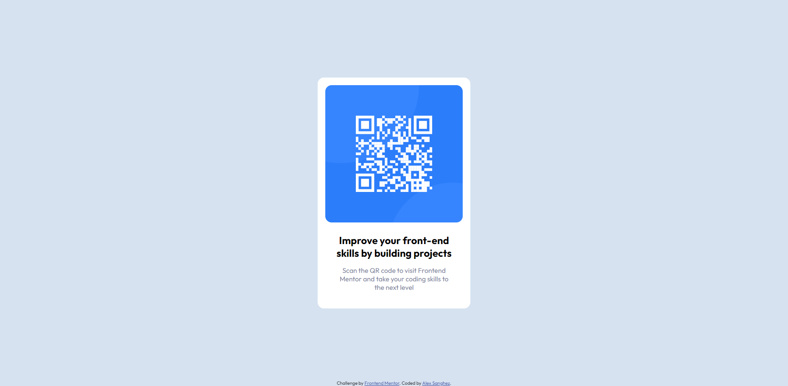

# Frontend Mentor - QR code component solution

This is a solution to the [QR code component challenge on Frontend Mentor](https://www.frontendmentor.io/challenges/qr-code-component-iux_sIO_H). Frontend Mentor challenges help you improve your coding skills by building realistic projects. 

## Table of contents

- [Overview](#overview)
  - [Screenshot](#screenshot)
  - [Links](#links)
- [My process](#my-process)
  - [Built with](#built-with)
  - [What I learned](#what-i-learned)
- [Author](#author)

## Overview
The folder structure of the original challenge was slightly changed for order motivs.
- The folder named "challenge" contains all the challenge instruction
- The folder named "solution" contains the solution i wrote for the challenge
- The fodler "screenshots" contains all the challenge screenshots

### Screenshot

### Links

- Solution URL: [Github](https://github.com/Alexsanghez/frontend-mentor-challenges/tree/main/qr-code-component-main)
- Live Site URL: [Add live site URL here](https://your-live-site-url.com)

## My process

My process was simple, i built the build blocks of the html such as the various divs and then just coded the css for the main qr code component!

### Built with

- Semantic HTML5 markup
- CSS custom properties
- Flexbox
- Mobile-first workflow

### What I learned

As it was a simple challenge i used the prior knowledge i have to complete it, so nothing learned this time but it's always fun writing css to put the block in places!

## Author

- Frontend Mentor - [@alexsanghez](https://www.frontendmentor.io/profile/Alexsanghez)
